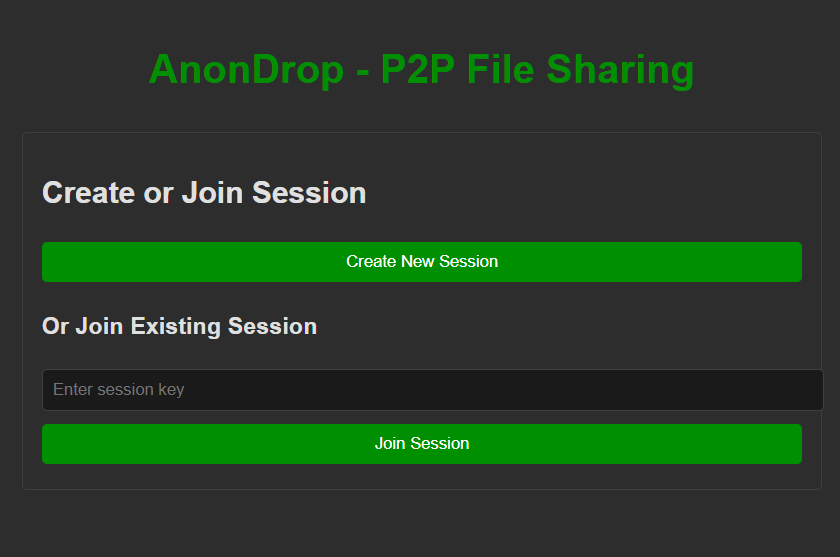
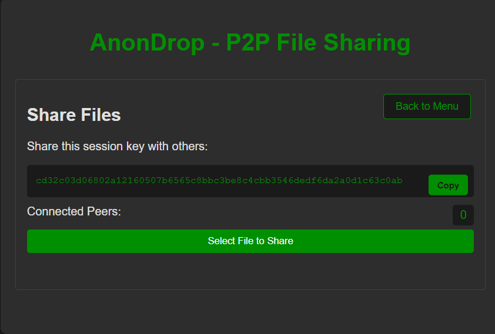
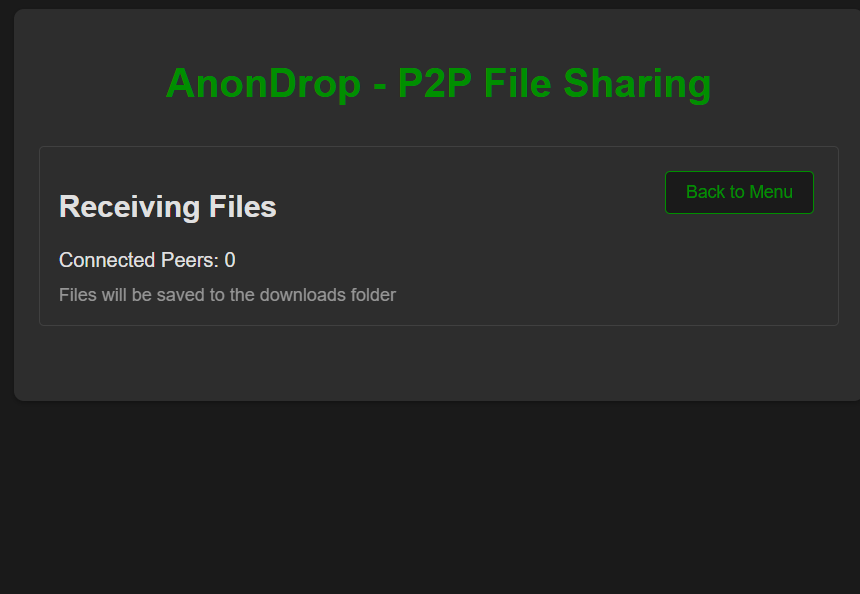

# AnonDrop - P2P File Sharing
by: [gabigonzalz](https://github.com/gabigonzalz) and [T-J05](https://github.com/T-J05)
> ⚠️ **Development Status Warning**
> 
> This application was developed during a 40-hour hackathon at Penguin Academy and is currently in its early development stages. While the core functionality works, there are several areas that still have bugs, need improvement and testing:
> 
> **Future Improvements:**
> - Add file transfer progress indicators
> - Implement file reception confirmations
> - Enhance error handling and recovery
> - Add file size limits and checks
> - Improve cross-network stability
> - Add file type validation
> - Implement better session management
> - Add connection status indicators
> - No confirmation dialog for receiving files
> - Testing on edge cases
> 
> Please use this application with caution and be aware that it may contain bugs or unexpected behavior. We greatly welcome feedback and contributions to improve the application.

A secure, peer-to-peer file sharing application built with [Pear by Holepunch](https://docs.pears.com). Share files directly between peers without any central server.

## Features

- 🔒 Secure peer-to-peer file sharing
- 🚀 No central server required
- 📁 Direct file transfers
- 🔑 Session-based sharing
- 🔄 DHT-based peer discovery
- 📱 Sleek UI
- 📋 Copy-to-clipboard functionality
- 📊 Real-time peer connection count

## Screenshots

### Main Interface


### Sharing Files


### Receiving Files


## Installation

1. Clone the repository:
```bash
git clone https://github.com/gabigonzalz/anondrop.git
cd anondrop
```

2. Install dependencies:
```bash
npm install
```

3. Start the application:
```bash
npm start
```

## Usage

### Creating a Session

1. Click "Create New Session"
2. Wait for the session to initialize
3. Copy the generated session key
4. Share the key with the recipient
5. Click "Select File to Share" to begin sharing files

### Joining a Session

1. Click "Join Existing Session"
2. Paste the session key provided by the sender
3. Click "Join Session"
4. Files will automatically download to your downloads folder

## Technical Details

- Built with Hyperdrive for P2P file storage
- Uses Hyperswarm for peer discovery and connection
- Implements Localdrive for local file system operations
- Secure file transfer with no central server
- Automatic file synchronization (folders are automatically mirrored)
- DHT-based peer discovery


## Development

### Prerequisites

- Node.js (v14 or higher)
- npm (v6 or higher)

### Project Structure

```
anondrop/
├── app.js              # Main application logic
├── index.html          # User interface
├── sender-folder/      # Files to share
├── downloads/          # Received files
├── storage/           # Storage for sender
└── storage-receiver/  # Storage for receiver
```

## Troubleshooting

### Connection Issues
- Check if your network allows P2P connections
- Verify the session key is correct
- Try rebooting the app if connection fails

### File Transfer Issues
- Check available disk space
- Ensure files aren't too large
- Check firewall settings

If you encounter any issues:
1. Make sure you have the latest version of Pear CLI
2. Try deleting the `node_modules` folder and running `npm install` again
3. Check the browser console (DevTools) for error messages 
## Contributing

1. Fork the repository
2. Create your feature branch (`git checkout -b feature/AmazingFeature`)
3. Commit your changes (`git commit -m 'Add some AmazingFeature'`)
4. Push to the branch (`git push origin feature/AmazingFeature`)
5. Open a Pull Request

## License

This project is licensed under the MIT License - see the [LICENSE](/LICENSE.md) file for details.

## Acknowledgments

- [Hyperdrive](https://github.com/hypercore-protocol/hyperdrive)
- [Hyperswarm](https://github.com/hyperswarm/hyperswarm)
- [Localdrive](https://github.com/hypercore-protocol/localdrive)

## Files to Share

Share these files with your teammate:
- `package.json`
- `app.js`
- `index.html`
- `.gitignore`
- `README.md`

### Big thank you to Penguin Academy for allowing us to develop our skills and trusting our creativity.